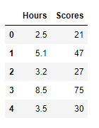
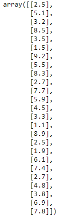
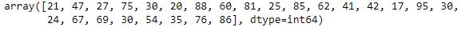
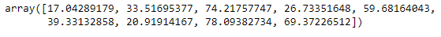
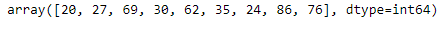
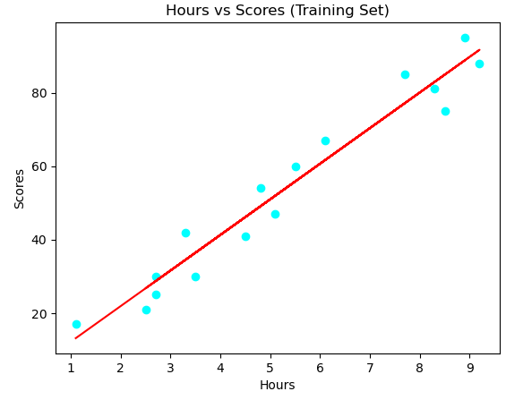
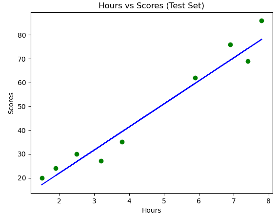
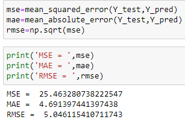

# Implementation-of-Simple-Linear-Regression-Model-for-Predicting-the-Marks-Scored

## AIM:
To write a program to predict the marks scored by a student using the simple linear regression model.

## Equipments Required:
1. Hardware – PCs
2. Anaconda – Python 3.7 Installation / Jupyter notebook

## Algorithm
1. 
2. 
3. 
4. 

## Program:
```
Program to implement the simple linear regression model for predicting the marks scored.
Developed by: Anish Raj P
RegisterNumber:  212222230010
```
```
import pandas as pd
df=pd.read_csv("Placement_Data.csv")
print(df.head())
print(df.iloc[3])
print(df.iloc[:,1:3])
print(df.iloc[:,:-1].values)
print(df.iloc[:,:])
import pandas as pd
import numpy as np
import matplotlib.pyplot as plt
from sklearn.metrics import mean_absolute_error,mean_squared_error
df=pd.read_csv("student_scores.csv")
df.head()
df.tail()
X=df.iloc[:,:-1].values
print(X)
Y=df.iloc[:,1].values
print(Y)

from sklearn.model_selection import train_test_split
X_train,X_test,Y_train,Y_test=train_test_split(X,Y,test_size=1/3,random_state=0)
from sklearn.linear_model import LinearRegression
regressor=LinearRegression()
regressor.fit(X_train,Y_train)
Y_pred=regressor.predict(X_test)
Y_pred
Y_test
plt.scatter(X_train,Y_train,color="cyan")
plt.plot(X_train,regressor.predict(X_train),color="red")
plt.title("Hours vs Scores (Training Set)")
plt.xlabel("Hours")
plt.ylabel("Scores")
plt.show()
plt.scatter(X_test,Y_test,color="green")
plt.plot(X_test,regressor.predict(X_test),color="blue")
plt.title("Hours vs Scores (Test Set)")
plt.xlabel("Hours")
plt.ylabel("Scores")
plt.show()

mse=mean_squared_error(Y_test,Y_pred)
mae=mean_absolute_error(Y_test,Y_pred)
rmse=np.sqrt(mse)
print('MSE = ',mse)
print('MAE = ',mae)
print('RMSE = ',rmse)
```

## Output:
### df.head():


### df.tail():


### X values:


### Y values:


### Y Prediction:


### Y Test:


### Training Set:


### Test Set:


### Error calculation:

## Result:
Thus the program to implement the simple linear regression model for predicting the marks scored is written and verified using python programming.
